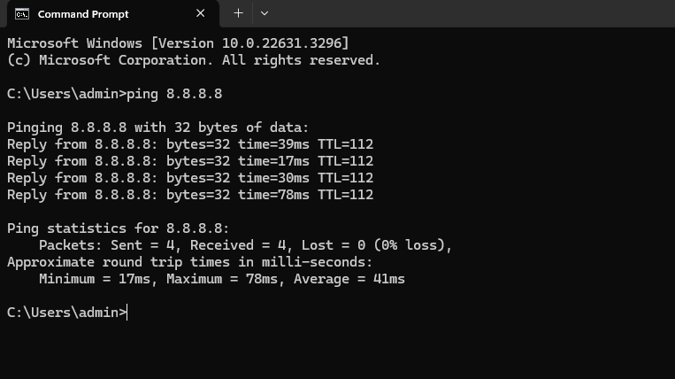
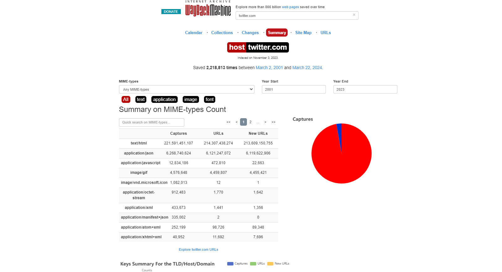
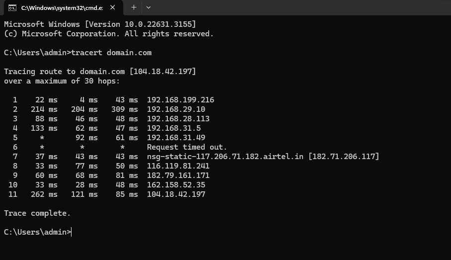

# InformationGathering
Information Gathering Techiques

# To perform information gathering techniques

# AIM:

To perform information gathering techniques using kali linux 

## STEPS:

### Step 1:

Install kali linux either in partition or virtual box or in live mode

### Step 2:

Investigate on the various categories of tools as follows:

### Step 3:
Open terminal/browser and try execute necessary commands/use url to perform information gathering

## Pen Test Tools Categories:  

Following Categories of pen test tools are identified for information gathering:
Footprinting is a part of the reconnaissance process which is used for gathering possible information about a target computer system or network.

## OUTPUT:

 http://www.whois.com/whois website to get detailed information about a domain name information including its owner, its registrar, date of registration, expiry, name server, owner's contact information, etc.
 

### Finding IP address:
ping command is available on Windows as well as on Linux OS. Following is the example to find out the IP address of facebook.com.

Finding Hosting Company get further detail by using ip2location.com website.

### History of the website:
https://web.archive.org/

### Webserver Fingerprinting:

1) Netcat:
sudo nc example.com 80
GET / HTTP/1.1
Host: example.com

2) Nmap:

3) Whatweb:

4) httprint:

### Tracing the Location
1) TCP Traceroute:
sudo traceroute -T www.google.com

2) UDP Traceroute:
sudo traceroute -U www.google.com

3) ICMP Traceroute:
sudo traceroute  www.google.com

## RESULT:
The information gathering techniques tools/procedure were  identified successfully
